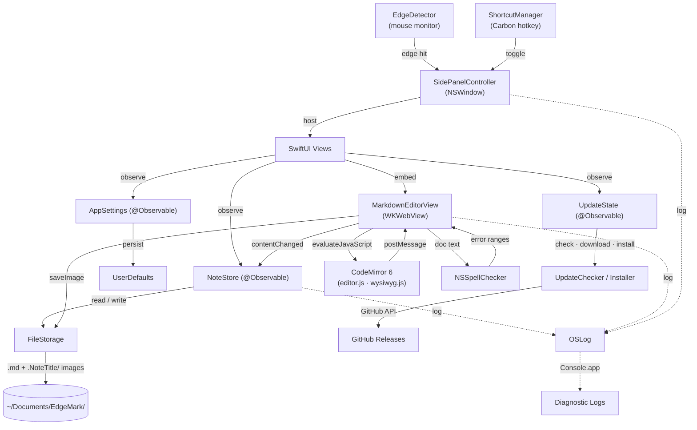

# Contributing to EdgeMark

**Requirements:** macOS 15.7+, Xcode 16.2+, [Homebrew](https://brew.sh)

```bash
brew install swiftformat
```

Code style is enforced by [SwiftFormat](https://github.com/nicklockwood/SwiftFormat) via CI — rules are in `.swiftformat` at the project root.

---

# Architecture

## Data Flow



## Source Tree

```
EdgeMark/
├── App/                            # Entry point + global state
│   ├── EdgeMarkApp.swift           #   @main, menu bar utility (LSUIElement)
│   ├── AppDelegate.swift           #   Lifecycle, storage migration, shortcut setup
│   └── ContentView.swift           #   Navigation shell (folders → notes → editor)
│
├── Core/                           # Business logic — no SwiftUI imports
│   ├── Editor/
│   │   ├── MarkdownEditorView.swift      # WKWebView ↔ CodeMirror 6 bridge
│   │   ├── ReadOnlyMarkdownView.swift    # Read-only Markdown preview (trash)
│   │   ├── SlashCommandHandler.swift     # /h1, /todo, /code, /quote routing
│   │   └── SlashCommandPopup.swift       # Floating autocomplete popup
│   ├── Settings/
│   │   └── AppSettings.swift       #   @Observable — sort order, date format, prefs
│   ├── Shortcuts/
│   │   ├── ShortcutManager.swift   #   Carbon RegisterEventHotKey global shortcut
│   │   ├── ShortcutSettings.swift  #   UserDefaults persistence for settings
│   │   └── KeyCodeTranslator.swift #   Virtual key code → display string mapping
│   ├── Storage/
│   │   ├── NoteStore.swift         #   @Observable — note CRUD, trash, folders, tag filter
│   │   ├── FileStorage.swift       #   Plain .md files with YAML front matter
│   │   ├── Note.swift              #   Note model (id, title, body, timestamps, tags)
│   │   ├── Folder.swift            #   Folder model
│   │   ├── TagColor.swift          #   Finder-style 7-color tag palette
│   │   └── TrashedFolder.swift     #   Trashed folder with expiry metadata
│   ├── Updates/
│   │   ├── UpdateChecker.swift     #   GitHub Releases API, version comparison
│   │   ├── UpdateDownloader.swift  #   URLSession delegate with progress tracking
│   │   ├── UpdateInstaller.swift   #   DMG mount → verify → copy → replace → restart
│   │   ├── UpdateModels.swift      #   GitHubRelease, UpdateProgress, UpdateError
│   │   ├── UpdateState.swift       #   @Observable — update UI state machine
│   │   └── ChecksumVerifier.swift  #   SHA256 verification via CryptoKit
│   └── Window/
│       ├── SidePanelController.swift     # NSWindowController — show/hide/animate
│       ├── EdgeDetector.swift            # Global mouse monitor → edge activation
│       ├── SettingsWindowController.swift # Settings window lifecycle
│       └── UpdateWindowController.swift  # Update window lifecycle
│
├── UI/                             # SwiftUI views
│   ├── EditorScreen.swift          #   Editor chrome (header, editor, footer)
│   ├── Navigation/
│   │   ├── HomeFolderView.swift    #   Folder list with create/rename/trash
│   │   ├── NoteListView.swift      #   Note cards with search, sort, context menus
│   │   └── TrashView.swift         #   Trash browser with restore/delete/empty
│   ├── Components/
│   │   ├── ContentFooterBar.swift  #   Bottom toolbar (word count, copy format picker)
│   │   ├── DateFormatting.swift    #   Shared date → display string helpers
│   │   ├── EmptyStateView.swift    #   Icon + title + subtitle placeholder
│   │   ├── FontPickerButton.swift  #   NSFontPanel button with live changeFont(_:) preview
│   │   ├── HeaderIconButton.swift  #   Standard icon button with hover UX
│   │   ├── InlineRenameEditor.swift#   Inline text field with "Name taken" overlay
│   │   ├── MoveConflictAlerts.swift#   View extension: note + folder move conflict dialogs
│   │   ├── NSContextMenuModifier.swift  # NSMenu context menus with SF Symbol icons
│   │   ├── NoteCardView.swift      #   Note list row (title, preview, date)
│   │   ├── NoteListMenus.swift     #   Note/folder context menu builders (incl. Tags submenu)
│   │   ├── PageLayout.swift        #   Navigation page chrome (header + content + footer)
│   │   ├── PinButton.swift         #   Toggle for ShortcutSettings.isPanelPinned
│   │   ├── ShortcutRecorderView.swift   # Key capture field for global shortcut setting
│   │   ├── SwipeDetectorView.swift #   NSView wrapper for two-finger swipe gestures
│   │   ├── TagDotsView.swift       #   Inline colored dots for note rows
│   │   ├── TagFilterBar.swift      #   Search-context tag filter strip
│   │   └── VisualEffectView.swift  #   NSVisualEffectView wrapper with optional tint sublayer
│   └── Settings/
│       ├── SettingsView.swift      #   Tab container (General, Behavior, Tags, Keyboard, About)
│       ├── GeneralSettingsTab.swift #   Appearance (incl. panel tint), editor font, language, storage
│       ├── BehaviorSettingsTab.swift#   Panel position, edge activation, auto-hide
│       ├── TagsSettingsTab.swift   #   Rename color tag labels
│       ├── KeyboardSettingsTab.swift#   Shortcut recorder + local shortcuts
│       ├── AboutSettingsTab.swift   #   Version info, links, copyright
│       └── UpdateView.swift        #   Download progress, verify, install UI
│
├── Shared/Utils/
│   ├── L10n.swift                  #   JSON-based i18n runtime
│   ├── Log.swift                   #   OSLog — 5 categories
│   └── Debouncer.swift             #   Generic debounce utility
│
└── Resources/
    ├── Editor/                     # CodeMirror 6 bundle — compiled by Xcode build phase
    │   ├── editor.html             #   WKWebView host page
    │   ├── editor-bundle.js        #   Compiled CM6 + WYSIWYG plugin (gitignored, generated)
    │   └── styles.css              #   Symlink to source (do not edit here)
    └── Locales/                    # i18n strings
        ├── en.json                 #   English
        └── zh-Hans.json            #   Simplified Chinese

Resources/Editor/                  # JS/CSS source (outside Xcode project)
├── src/
│   ├── editor.js                  #   CM6 setup, Swift ↔ JS bridge, keyboard maps
│   ├── wysiwyg.js                 #   WYSIWYG ViewPlugin: decorations, widgets (images, tables, checkboxes, copy button)
│   └── styles.css                 #   Editor theme source
├── dist/                          #   Intermediate build output (gitignored)
├── package.json                   #   esbuild config
└── build.sh                       #   Full build: bundle JS + copy to Swift target
```

> **Editor development:** Edit files in `Resources/Editor/src/`. The Xcode build phase ("Build JS Editor") runs `npm run build` automatically when any source file changes — no manual step required. CI runs the same build before `xcodebuild`. The compiled bundle is written to `EdgeMark/Resources/Editor/editor-bundle.js` (gitignored).

## Key Patterns

| Pattern | Detail |
|---------|--------|
| **@Observable** | `NoteStore`, `AppSettings`, and `UpdateState` use the `@Observable` macro — views read properties directly, no `@Published` needed |
| **MainActor by default** | `SWIFT_DEFAULT_ACTOR_ISOLATION = MainActor`. All types are `@MainActor` unless explicitly opted out |
| **AppKit + SwiftUI hybrid** | `NSHostingView` embeds SwiftUI inside a borderless `NSWindow`. Panel lifecycle managed by `SidePanelController` (AppKit), UI rendered by SwiftUI |
| **File-based storage** | Notes are plain `.md` files with YAML front matter — no database, readable by any Markdown editor |
| **Image asset co-location** | Images are stored in a hidden dot-prefix directory next to the note (`.NoteTitle/IMG-uuid.png`). Paths in `.md` files are relative so they resolve in any external editor. `FileStorage` handles create/rename/move/trash/delete of asset dirs alongside their note |
| **Swift ↔ JS editor bridge** | Swift calls `window.editorAPI.*` via `evaluateJavaScript`. JS posts to Swift via `webkit.messageHandlers.editor.postMessage({action, ...})`. `MarkdownEditorView.Coordinator.handleMessage` dispatches on `action`. `EditorWebView` (WKWebView subclass) overrides `performKeyEquivalent` to intercept Cmd+V for native image paste |
| **Spell checking** | `NSSpellChecker` runs on Swift side after each debounced edit; error ranges are sent to JS as `setSpellErrors([{from, to}])`; CM6 renders them as `Decoration.mark` with a dotted red underline. Survives CM6's DOM re-renders because decorations live in CM6 state |
| **Carbon hotkeys** | Global shortcut uses `RegisterEventHotKey` (Carbon API) since `NSEvent.addGlobalMonitorForEvents` can't intercept key events |
| **JSON i18n** | `L10n` loads locale JSON at runtime. Access: `l10n["key"]` or `l10n.t("key", arg1, arg2)` for interpolation |
| **OSLog diagnostics** | 5 categorized loggers (app, storage, window, shortcuts, updates). View in Console.app with `subsystem:io.github.ender-wang.EdgeMark` |
| **DMG auto-update** | `UpdateChecker` queries GitHub Releases API. `UpdateInstaller`: mount DMG → verify bundle ID → copy → replace → restart |

---

# Localization

EdgeMark uses a custom JSON-based i18n system. Currently supported:

| Language | File | Status |
|----------|------|--------|
| English | `Resources/Locales/en.json` | ✅ |
| Simplified Chinese | `Resources/Locales/zh-Hans.json` | ✅ |

## Contributing a Translation

1. Copy `Resources/Locales/en.json`
2. Rename to your language code (e.g. `ja.json`, `ko.json`, `fr.json`, `de.json`)
3. Translate the values (keep the keys as-is)
4. Submit a PR

No code changes needed — the app picks up new locale files automatically.

---

# Submitting a Pull Request

- Target the `main` branch.
- Run `swiftformat EdgeMark/` before pushing — CI fails on lint errors.
- **Do not modify** `MARKETING_VERSION` or `CURRENT_PROJECT_VERSION` in `EdgeMark.xcodeproj/project.pbxproj`. Releases are cut by the maintainer from `main`/`develop`; PRs that bump these values will fail the `check-version` CI step.
